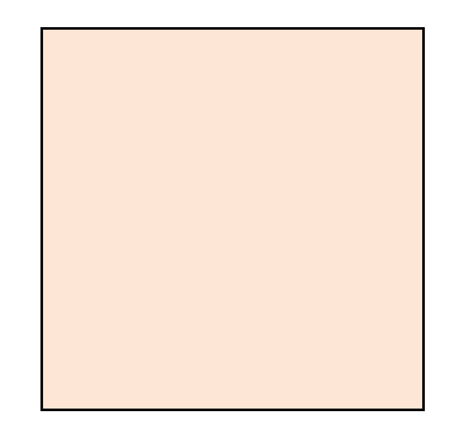
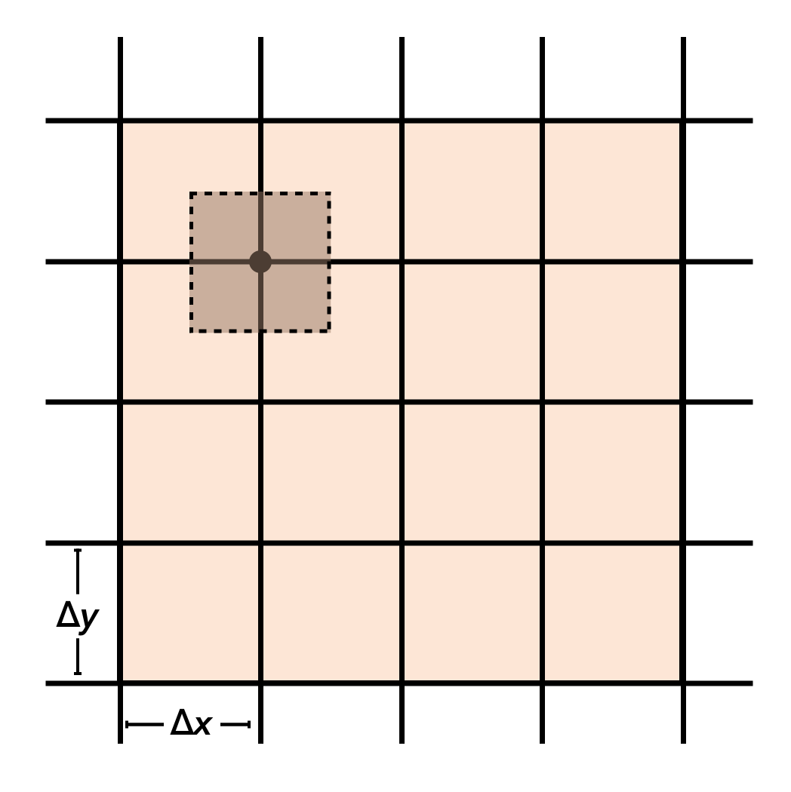
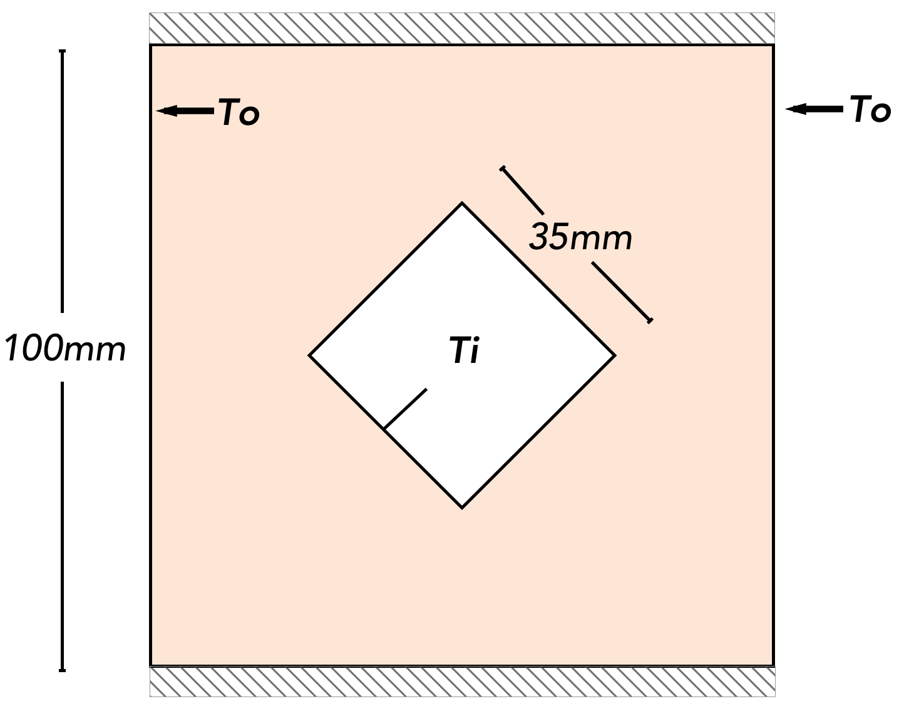
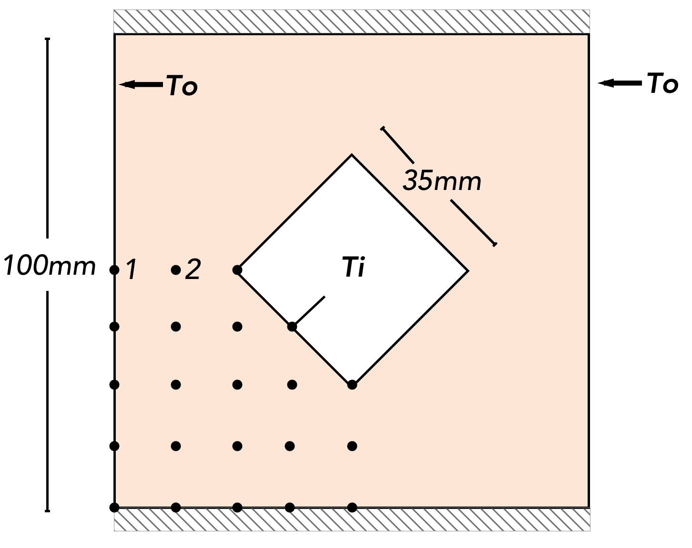

```{r echo=FALSE, cached=TRUE}
library(knitr)
read_chunk('plot_solution.R')
```
## Background
The finite difference method is a way to estimate differentials in order to estimate solutions to differential equations. In our case, we can use the finite difference method to estimate the solution to the 2-D conduction problem:

$$\frac{\partial^2 T}{\partial x^2} + \frac{\partial^2 T}{\partial y^2} = -\frac{Q_v}{k}$$

We'll start by looking at our 2D surface where conduction is occurring. For simplicity, let's imagine a square surface:

```{r, out.width = "300px", message = FALSE, echo = FALSE, fig.align = "center"}

```

To use the finite difference method here, we'll divide our surface with a series of vertical and horizontal lines. At the intersection of the lines lies a `node`. Each `node` represents the center of a `cell` of our surface (represented with the dashed lines in the figure below), in which we assume the temperature is uniform throughout. While equal spacings of $\Delta x$ and $\Delta y$ are not required, they simplify the equations.

```{r, out.width = "300px", message = FALSE, echo = FALSE, fig.align = "center"}

```

By doing an energy balance on each `cell` we can relate the temperature of each `cell` to those of its neighboring cells. Depending on the environment of the cell *(e.g. whether it is surrounded completely by other nodes, whether it is on an adiabat, etc.)*, the equations will vary slightly. The forms of these equations for the end-user can be found in **Table 3-2** in *Bergman*. For instance, for an interior node, the equation is simply:
$$0 = T_{m+1, n} + T_{m, n+1} + T_{m-1, n} + T_{m, n-1} - 4T_{m, n}$$
Where $m$ refers to the column of the node and $n$ refers to the row of the now. Looking at this we can see that the temperature of the node is just the weighted average of the adjacent nodes.

After formulating an equation for each `node` in our system, we are left with a system of **n** nodes with **n** equations and **n** unknowns. This system can be solved with linear algebra methods (e.g. solving **Ax** = **b**) to find the temperature at each `node`.

---
## Project

### Problem Statement:
Given the hollow carbon steel bar (*k~s~* = 54 Wm^-1^K^-1^), with top and bottom surfaces perfectly insulated, find the heat transfer rate (per unit length) and shape factor, when T~i~ = 230ºC and T~o~ = 30ºC.

```{r, out.width = "300px", echo = FALSE, fig.align = "center"}

```

### Solution Formulation:
1. First the nodal system is defined. For illustration purposes, a rather small number of nodes is shown. The denser your nodal system the more precise your solution will be. As this system displays 2-fold symmetry, only one quarter of the bar needs to be solved.

```{r, out.width = "300px", echo = FALSE, fig.align = "center"}

```

2. For each node, the corresponding equation is written. For example, the equations for nodes 1 and 2 are shown below:
$$T_1 = T_o$$
$$0 = T_1 + T_3 + 2T_5 - 4T_2$$
3. These equations are then arranged into matrix form. For example, the equations for nodes 1 and two would be:
$$\mathbf{m} = \left[\begin{array}
{rrrrr}
1 & 0 & 0 & 0 & 0 \\
1 & -4 & 1 & 0 & 2 \\
\end{array}\right]
$$
$$\mathbf{b} = \left[\begin{array}
{rr}
T_o \\
0 \\
\end{array}\right]
$$
Although a properly defined system should have a **n x n** **m** matrix and a **b** vector of length **n**.

4. For small systems such as this 22 equation system, the typical matrix algebra method can be used (e.g. **x** = **A**^-1^**b**). For larger systems, sparse matrix techniques are much less computationally expensive. Three software packages that support these sparse techniques are: `Mathematica`, `MATLAB` and Python's `scipy` package. For example, here is an implementation in Mathematica:
```
m = SparseArray[{{1, 1, 1}, {0, 2, 5}, {2, 5, -1}}] # input row-by-row
b = SparseArray[{{6}, {-4}, {27}}]
LinearSolve[m, b]
> {{5}, {3}, {-2}}
```
Mathematica makes this easy, as if `LinearSolve` is given sparse matrices as inputs it will use sparse methods to solve the system.

5. If a more precise solution is desired, a more refined nodal system can be defined. For example, the solution from a system of 2290 nodes is visualized below:

```{r echo = FALSE, message = FALSE, fig.align='center', cached = TRUE}
<<plotSolution>>
plot
```

6. To find the heat transfer rate, we can either look at the the heat passing through the outer surface, or the heat passing through the inner surface. As the inner surface is on an angle, it will be easier to look at the outer surface. First we go to Fourier's law:
$q = -k \nabla T$. The heat transfer from the surface nodes to nodes one 'step' into the surface is one dimensional, so we can rewrite fourier's law as $q = -k \frac{dT}{dx}$. Since we're dealing with finite differences, this is further simplified to $q = -k \frac{\Delta T}{\Delta x}$. The area through which heat is passing is $L \Delta y$, so the total heat passing through one cell can be given as $\frac{Q_i}{L} = -k \Delta T$ as $\Delta y = \Delta x$. Now we just sum over all nodes to get the total heat transfer rate:
$$\frac{Q_{tot}}{L} = 4 \sum^i \frac{Q_i}{L}$$
The 4 is required due to the symmetry used in setting up the problem.

7. To find the shape factor, we see that we can generalize the heat transfer between two isothermal surfaces as $Q = kS \Delta T$. Since we know $k$, $Q$, and $\Delta T$ we can directly solve for $S$.
